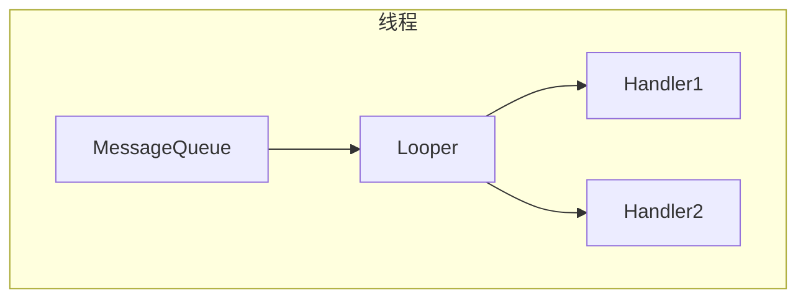

# Handler介绍

`Handler` 是 Android 下异步线程通讯的主要机制，关于 `Handler` 的简单介绍如下图所示


在 `Handler` 机制中，主要的参与对象以及关系在上图中已经很清晰了，我这里在简单介绍一下：

* `Handler` 异步消息的发送者，也是消息的处理者，但是值得注意的是发送的处理可以在不同线程

* `MessageQueue` 线程安全的消息队列，线程的变换主要是在 `MessageQueue` 中完成

* `Messager` 异步通信内容的载体

* `Looper` 通过循环不断的从 `MessageQueue` 中获取消息，然后分发给 `Handler` 处理，和`MessageQueue` 是一一对应的关系

简单的介绍到此为止，下面开始详细介绍整个消息发送过程。

# Handler消息机制

## Handler创建

针对 `Handler` 消息机制，我这边直接从 `Handler` 构造函数开始解析

```java
public Handler(Callback callback, boolean async) {
    //内存泄漏警告
	......
    //获取Looper
    mLooper = Looper.myLooper();
    if (mLooper == null) {
        throw new RuntimeException(
            "Can't create handler inside thread that has not called Looper.prepare()");
    }
    mQueue = mLooper.mQueue;
    mCallback = callback;
    mAsynchronous = async;
}

//Looper是通过ThreadLocal获取的线程私有的变量，但是默认为null
public static @Nullable Looper myLooper() {
    return sThreadLocal.get();
}

//创建Looper对象并设置给ThreadLocal
private static void prepare(boolean quitAllowed) {
    if (sThreadLocal.get() != null) {
        throw new RuntimeException("Only one Looper may be created per thread");
    }
    sThreadLocal.set(new Looper(quitAllowed));
}

//创建MessageQueue对象
private Looper(boolean quitAllowed) {
    mQueue = new MessageQueue(quitAllowed);
    mThread = Thread.currentThread();
}
```

上面这一段代码看似很多，其实就是告诉我们如果想要创建 `Handler` 就得先有一个 `Looper` ,  `Looper` 是跟线程绑定的，创建 `Looper` 的同时它也会把 `MessageQueue` 也一起创建好，我们平时在主线程中的用的时候不要  `Looper` ,是因为主线程以及帮我们干了。

```java
public final class ActivityThread {
    public static void main(String[] args) {
		.....
        Looper.prepareMainLooper();
        ......
        Looper.loop();
        throw new RuntimeException("Main thread loop unexpectedly exited");
    }
}
```

到现在可以确定线程、`Looper` 、`Handler` 、`MessageQueue` 的关系如下



## 消息发送

使用 `Handler` 发送消息可以有多种形式，`Handler.sendMessage()` 、`Message.sendToTarget()` 以及类似的一些方法都可以发送消息，但是不管是哪种方法最终都会调用`Handler.enqueueMessage()` 方法。

```java
private boolean enqueueMessage(MessageQueue queue, Message msg, long uptimeMillis) {
    msg.target = this;
    if (mAsynchronous) {
        //发送异步消息
        msg.setAsynchronous(true);
    }
    return queue.enqueueMessage(msg, uptimeMillis);
}
```

这个方法也没有做太多逻辑处理，直接调用了 `MessageQueue` 的 `enqueueMessage` 方法

```java
boolean enqueueMessage(Message msg, long when) {
	......
    synchronized (this) {
       	......
        msg.markInUse();
        msg.when = when;
        Message p = mMessages;
        boolean needWake;
        if (p == null || when == 0 || when < p.when) {
            // New head, wake up the event queue if blocked.
            msg.next = p;
            mMessages = msg;
            needWake = mBlocked;
        } else {
            // Inserted within the middle of the queue.  Usually we don't have to wake
            // up the event queue unless there is a barrier at the head of the queue
            // and the message is the earliest asynchronous message in the queue.
            needWake = mBlocked && p.target == null && msg.isAsynchronous();
            Message prev;
            for (;;) {
                prev = p;
                p = p.next;
                if (p == null || when < p.when) {
                    break;
                }
                if (needWake && p.isAsynchronous()) {
                    needWake = false;
                }
            }
            msg.next = p; // invariant: p == prev.next
            prev.next = msg;
        }

        // We can assume mPtr != 0 because mQuitting is false.
        if (needWake) {
            nativeWake(mPtr);
        }
    }
    return true;
}
```

这一段事实上就是一个单链表插入，`mMessages` 为链表头，如果链表为空则直接把 `msg` 赋给表头，否则通过循环找到链表最后进行插入。`MessageQueue` 的消息在 `Looper.loop()` 来获取并处理的。

```java
public static void loop() {
    final Looper me = myLooper();
    if (me == null) {
        throw new RuntimeException("No Looper; Looper.prepare() wasn't called on this thread.");
    }
    final MessageQueue queue = me.mQueue;
    
    // Make sure the identity of this thread is that of the local process,
    // and keep track of what that identity token actually is.
    Binder.clearCallingIdentity();
    final long ident = Binder.clearCallingIdentity();
    for (;;) {
        Message msg = queue.next(); // might block
        if (msg == null) {
            // No message indicates that the message queue is quitting.
            return;
        }

        // This must be in a local variable, in case a UI event sets the logger
        final Printer logging = me.mLogging;
        if (logging != null) {
            logging.println(">>>>> Dispatching to " + msg.target + " " +
                            msg.callback + ": " + msg.what);
        }

        final long slowDispatchThresholdMs = me.mSlowDispatchThresholdMs;

        final long traceTag = me.mTraceTag;
        if (traceTag != 0 && Trace.isTagEnabled(traceTag)) {
            Trace.traceBegin(traceTag, msg.target.getTraceName(msg));
        }
        final long start = (slowDispatchThresholdMs == 0) ? 0 :SystemClock.uptimeMillis();
        final long end;
        try {
            msg.target.dispatchMessage(msg);
            end = (slowDispatchThresholdMs == 0) ? 0 : SystemClock.uptimeMillis();
        } finally {
            if (traceTag != 0) {
                Trace.traceEnd(traceTag);
            }
        }
        if (slowDispatchThresholdMs > 0) {
            final long time = end - start;
            if (time > slowDispatchThresholdMs) {
                Slog.w(TAG, "Dispatch took " + time + "ms on "
                       + Thread.currentThread().getName() + ", h=" +
                       msg.target + " cb=" + msg.callback + " msg=" + msg.what);
            }
        }

        if (logging != null) {
            logging.println("<<<<< Finished to " + msg.target + " " + msg.callback);
        }

        // Make sure that during the course of dispatching the
        // identity of the thread wasn't corrupted.
        final long newIdent = Binder.clearCallingIdentity();
        if (ident != newIdent) {
            Log.wtf(TAG, "Thread identity changed from 0x"
                    + Long.toHexString(ident) + " to 0x"
                    + Long.toHexString(newIdent) + " while dispatching to "
                    + msg.target.getClass().getName() + " "
                    + msg.callback + " what=" + msg.what);
        }

        msg.recycleUnchecked();
    }
}
```

`loop()` 方法主要就是在一个无限循环中不断的通过 `next` 获取消息，然后使用 `dispatchMessage` 把消息交回给Handler处理。现在我们回头来看 `next` 方法是如何获取消息的。

```java
Message next() {
   	......
    int pendingIdleHandlerCount = -1; // -1 only during first iteration
    int nextPollTimeoutMillis = 0;
    for (;;) {
        if (nextPollTimeoutMillis != 0) {
            Binder.flushPendingCommands();
        }

        nativePollOnce(ptr, nextPollTimeoutMillis);

        synchronized (this) {
            // Try to retrieve the next message.  Return if found.
            final long now = SystemClock.uptimeMillis();
            Message prevMsg = null;
            Message msg = mMessages;
            if (msg != null && msg.target == null) {
                // Stalled by a barrier.  Find the next asynchronous message in the queue.
                do {
                    prevMsg = msg;
                    msg = msg.next;
                } while (msg != null && !msg.isAsynchronous());
            }
            if (msg != null) {
                if (now < msg.when) {
                    // Next message is not ready.  Set a timeout to wake up when it is ready.
                    nextPollTimeoutMillis = (int) Math.min(msg.when - now, Integer.MAX_VALUE);
                } else {
                    // Got a message.
                    mBlocked = false;
                    if (prevMsg != null) {
                        prevMsg.next = msg.next;
                    } else {
                        mMessages = msg.next;
                    }
                    msg.next = null;
                    if (DEBUG) Log.v(TAG, "Returning message: " + msg);
                    msg.markInUse();
                    return msg;
                }
            } else {
                // No more messages.
                nextPollTimeoutMillis = -1;
            }
	
       
    }
}
```

 `next` 方法的主要逻辑都在一个无限循环内，知道获取到消息才会返回，同时把消息从链表中移除。同时默认获取的是链表头，只有当 `msg.target == null` 时才会获取链表后第一个同步消息，但是要知道我们通过 `Handler` 发送的消息 `target` 都是 `Handler` 本身，事实上这是消息屏障机制

## 同步屏障

事实上消息分为同步和异步两种，通过 `isAsynchronous` 来判断，我们平时使用的一般是异步消息 ,同步消息主要用于页面绘制等对时间敏感的地方，但是在通常情况下即使我们使用 `setAsynchronous(true)` 来手动设置一个同步消息它也不会生效，`MessageQueue` 还是会把他当作普通消息处理，只有配合 `postSyncBarrier` 添加一个同步屏障之后才能使用。

```java
public int postSyncBarrier() {
    return postSyncBarrier(SystemClock.uptimeMillis());
}
private int postSyncBarrier(long when) {
    // Enqueue a new sync barrier token.
    // We don't need to wake the queue because the purpose of a barrier is to stall it.
    synchronized (this) {
        final int token = mNextBarrierToken++;
        final Message msg = Message.obtain();
        msg.markInUse();
        msg.when = when;
        msg.arg1 = token;

        Message prev = null;
        Message p = mMessages;
        if (when != 0) {
            while (p != null && p.when <= when) {
                prev = p;
                p = p.next;
            }
        }
        if (prev != null) { // invariant: p == prev.next
            msg.next = p;
            prev.next = msg;
        } else {
            msg.next = p;
            mMessages = msg;
        }
        return token;
    }
}
```

`postSyncBarrier` 是一个隐藏 Api，我们无法调用，但这不妨碍我们分析它，它直接向 `MessageQueue` 的单链表中头插入了一个 `target==null` 的消息，也就是上一节 `next` 方法中的逻辑，当这种情况下，`MessageQueue` 会忽略所有的异步消息，只获取同步消息，需要调用 `removeSyncBarrier(int token)` 才能取消这个同步屏障，目前同步屏障主要是在 `ViewRootImpl` 绘制时使用。