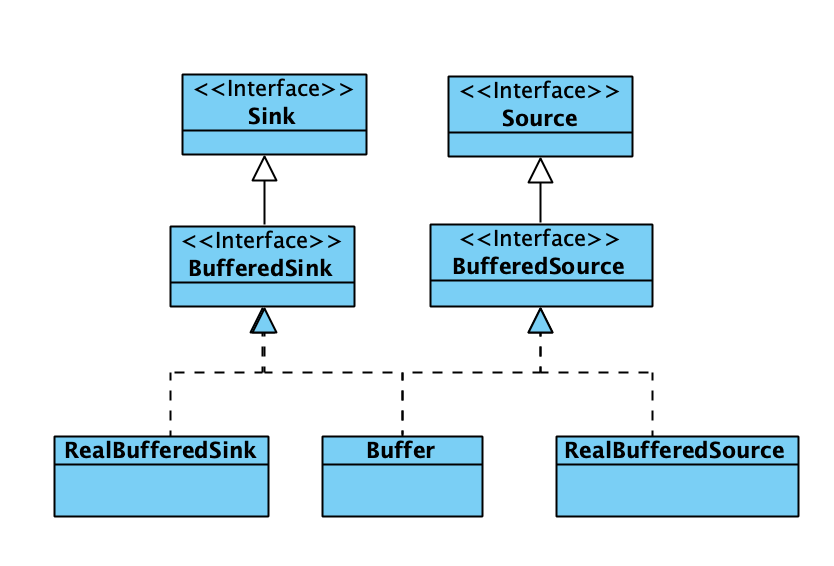
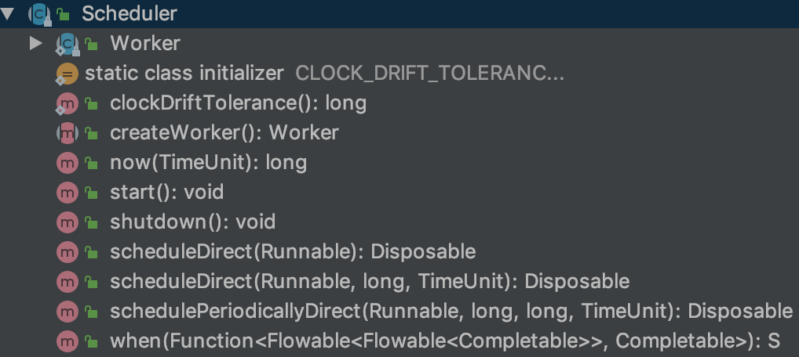

## 一次网络请求

目前我们的网络框架采用RxJava+Retrofit+OkHttp，使用起来非常简单，只需要简单几行代码便能完成整个网络请求

```java
retrofit.create(serviceClass)
  .getNoticeInfo(CommonConstant.COURSE_TYPE_FACE)
		.subscribeOn(Schedulers.io())
    .unsubscribeOn(Schedulers.io())
    .observeOn(AndroidSchedulers.mainThread())
  	.subscribe(new BJYNetObserver<JsonObject>() {
          ......
     });
```

这些高度封装的第三方库内部却不是这么简单，我们就跟随一条简单的网络一起探索一下这个全过程。

## Retrofit

网络请求的开始从Retrofit开始，Retrofit的核心是动态代理，通过注解和返回值来创建Restful的网络请求。所以Retrofit的核心代码不算太多，从我们通过create创建了网络请求的代理类开始

```java
 public <T> T create(final Class<T> service) {
    Utils.validateServiceInterface(service);
    if (validateEagerly) {
      eagerlyValidateMethods(service);
    }
    //创建接口的代理对象
    return (T) Proxy.newProxyInstance(service.getClassLoader(), new Class<?>[] { service },
        new InvocationHandler() {
          private final Platform platform = Platform.get();
          @Override public Object invoke(Object proxy, Method method, Object... args)
              throws Throwable {
            ......
            //解析接口方法，根据方法参数、返回值和注解生成需要的参数
            ServiceMethod serviceMethod = loadServiceMethod(method);
            OkHttpCall okHttpCall = new OkHttpCall<>(serviceMethod, args);
            return serviceMethod.callAdapter.adapt(okHttpCall);
          }
        });
  }
```

在loadServiceMethod中有大量逻辑都是处理Retrofit的注解生成相应网络请求Request的过程（这个不是本文的重点），同时还会获得两个比较重要的对象 `CallAdapter` 和 `Converter` ,这两个对象都是用于在请求过程中对于网络请求的结果进行转换，但是两者的作用不同

* `Converter` 主要用于值转换，可以自定义将原始的ResponseBody转换成String或者其他对象，一般用于Gson解析

* `CallAdapter` 用于将Call转换成其他对象，Call对象本身是一个接口，Retrofit的主要实现类是OkHttpCall，这个是OkHttp中RealCall的封装类

这个两个对象在实际流程中的关系如下

```
ResponseBody -> Converter -> T
Call<T> -> CallAdapter -> Other
```

`ResponseBody` 经过 `Converter` 转换后的类型回作为Call对象范型类型，然后通过 `CallAdapter` 转换成其他类型。

这两个对象都是通过抽象工厂模式来创建，我们可以添加抽象工厂来自定义这两个对象，`Converter` 和`CallAdapter` 中具体工厂都是根据他们的返回值类型来确定的，首先确定是 `CallAdapter` 的工厂，然后根据 `CallAdapter.adapt`  方法的入参Call的范型类型确定 `Converter `

##OkHttp

`OkHttpClient` 的创建和`RealCall` 的创建过程就不多做介绍了，我们从RealCall的`execute` 和 `enqueue` 两个方法开始。

 ```java
@Override public Response execute() throws IOException {
  	......
    try {
      client.dispatcher().executed(this);//1
      Response result = getResponseWithInterceptorChain();//2
      if (result == null) throw new IOException("Canceled");
      return result;
    } finally {
      client.dispatcher().finished(this);
    }
}

@Override public void enqueue(Callback responseCallback) {
  	......
  	client.dispatcher().enqueue(new AsyncCall(responseCallback));//3
}
 ```

可以看到这两个方法一个是同步请求，一个是异步请求，但是在1和3处都使用到了 `Dispatcher` 这个对象，同时同步请求回在2处直接调用 `getResponseWithInterceptorChain` 执行请求，我们先看一下 `Dispatcher` 这个对象的几个重要成员。

```java
/** Executes calls. Created lazily. */
private @Nullable ExecutorService executorService;

/** Ready async calls in the order they'll be run. */
private final Deque<AsyncCall> readyAsyncCalls = new ArrayDeque<>();

/** Running asynchronous calls. Includes canceled calls that haven't finished yet. */
private final Deque<AsyncCall> runningAsyncCalls = new ArrayDeque<>();

/** Running synchronous calls. Includes canceled calls that haven't finished yet. */
private final Deque<RealCall> runningSyncCalls = new ArrayDeque<>();
```

可以看到 `Dispatcher` 中有三个队列以及一个 `Executor` ，而这个 `Executor` 事实上是一个线程池,从变量命名上看 `Dispatcher` 的实现已经很明显了

* 一个异步请求的等待队列
* 一个异步请求的执行队列
* 一个同步请求的执行队列
* 一个异步请求的线程池

在前面的代码中我看到在执行异步请求时会把 `RealCall` 封装在 `AsyncCall` 内，我们看一下 `AsyncCall` 的execute方法

```java
@Override protected void execute() {
  boolean signalledCallback = false;
  try {
    Response response = getResponseWithInterceptorChain();
    if (retryAndFollowUpInterceptor.isCanceled()) {
      signalledCallback = true;
      responseCallback.onFailure(RealCall.this, new IOException("Canceled"));
    } else {
      signalledCallback = true;
      responseCallback.onResponse(RealCall.this, response);
    }
  } catch (IOException e) {
    ......
  } finally {
    client.dispatcher().finished(this);
  }
}
```

可以看到异步请求最终也是调用了 `getResponseWithInterceptorChain` 方法来执行最终的请求，OkHttp可以分为两段，而这个方法是下半段的开始，也是OkHttp请求的核心。

```java
 Response getResponseWithInterceptorChain() throws IOException {
    // Build a full stack of interceptors.
    List<Interceptor> interceptors = new ArrayList<>();
    interceptors.addAll(client.interceptors());
    interceptors.add(retryAndFollowUpInterceptor);
    interceptors.add(new BridgeInterceptor(client.cookieJar()));
    interceptors.add(new CacheInterceptor(client.internalCache()));
    interceptors.add(new ConnectInterceptor(client));
    if (!forWebSocket) {
      interceptors.addAll(client.networkInterceptors());
    }
    interceptors.add(new CallServerInterceptor(forWebSocket));

    Interceptor.Chain chain = new RealInterceptorChain(
        interceptors, null, null, null, 0, originalRequest);
    return chain.proceed(originalRequest);
  }
```

在OkHttp中使用拦截器链来进行网络请求，且内置了五个拦截器，在查看这五个拦截器之前，我们先看一下拦截器链的结构

```java
//RealInterceptorChain.java
public Response proceed(Request request, StreamAllocation streamAllocation, HttpCodec httpCodec, RealConnection connection) throws IOException {
    if (index >= interceptors.size()) throw new AssertionError();

    calls++;
		......
    // Call the next interceptor in the chain.
    RealInterceptorChain next = new RealInterceptorChain(
        interceptors, streamAllocation, httpCodec, connection, index + 1, request);
    Interceptor interceptor = interceptors.get(index);
    Response response = interceptor.intercept(next);
    ......
    return response;
  }
```

可以看到 `RealInterceptorChain` 每执行一个拦截器都会创建一个新的 `RealInterceptorChain` 对象，同时通过index控制目前使用的拦截器，并调用拦截器的 `intercept` 方法。

### RetryAndFollowUpInterceptor

在这个拦截器内主要做了两件事

* 创建了StreamAllocation对象，这个对象在后面再详细介绍
* 根据网络请求的相应错误码比如301、408，进行重试

```java
@Override public Response intercept(Chain chain) throws IOException {
    Request request = chain.request();

 		.....
    int followUpCount = 0;
    while (true) {
      .....
      try {
        response = ((RealInterceptorChain) chain).proceed(request, streamAllocation, null, null);
        releaseConnection = false;
      } catch (RouteException e) { 
        ......
      } finally {
        ......
      }
      ......
      //根据相应码获取下一次请求的Request
      Request followUp = followUpRequest(response);
      if (followUp == null) {
        if (!forWebSocket) {
          streamAllocation.release();
        }
        return response;
      }
      closeQuietly(response.body());
      if (++followUpCount > MAX_FOLLOW_UPS) {
        streamAllocation.release();
        throw new ProtocolException("Too many follow-up requests: " + followUpCount);
      }
      ......
    }
  }
```

### BridgeInterceptor

主要是对请求头和响应头的处理，比如添加一些`Content-Length`,`Content-Type` 等通用的请求头，同时cookie、请求体和响应体gzip压缩和解压的处理也是在这个拦截器

```java
@Override public Response intercept(Chain chain) throws IOException {
    //添加必要的请求头
  	.......
    List<Cookie> cookies = cookieJar.loadForRequest(userRequest.url());
    if (!cookies.isEmpty()) {
      requestBuilder.header("Cookie", cookieHeader(cookies));
    }
  	.......
    Response networkResponse = chain.proceed(requestBuilder.build());

    HttpHeaders.receiveHeaders(cookieJar, userRequest.url(), networkResponse.headers());

    Response.Builder responseBuilder = networkResponse.newBuilder()
        .request(userRequest);

    if (transparentGzip
        && "gzip".equalsIgnoreCase(networkResponse.header("Content-Encoding"))
        && HttpHeaders.hasBody(networkResponse)) {
      GzipSource responseBody = new GzipSource(networkResponse.body().source());
      Headers strippedHeaders = networkResponse.headers().newBuilder()
          .removeAll("Content-Encoding")
          .removeAll("Content-Length")
          .build();
      responseBuilder.headers(strippedHeaders);
      String contentType = networkResponse.header("Content-Type");
      responseBuilder.body(new RealResponseBody(contentType, -1L, Okio.buffer(responseBody)));
    }

    return responseBuilder.build();
  }
```

这个地方第一次出现了Source，这个是OkIo中定义的对象，是IO流的封装类，后面详细介绍

### CacheInterceptor

`CacheInterceptor` 的意义从名称上来看来已经很明显了，但是这个Okhttp的实现可能和我们想象中的不一 样，`CacheInterceptor` 主要针对的是`304 HTTP_NOT_MODIFIED` 响应码，一般正常的网络请求都会正常进行，但是会在后台返回304时，使用本地缓存

`CacheInterceptor` 主要关注什么样的请求响应需要被缓存和缓存的时常（这往往取决于Http的头部信息），具体的缓存使用 `DiskLruCache`  来实现，但是OkHttp对于 `DiskLruCache` 底层IO使用OkIO重写了，有兴趣的可以自行研究

Okhttp中前三个拦截器都是相对比较容易理解的，但是从第四个拦截器开始，负责度就开始提升了，这个原因主要有两个

* 从第四个拦截器开始，OkIO的相关代码开始大量出现，提高了代码复杂度
* OkHttp实现了Http2.0协议，从这里开始有很多Http2.0的实现代码（这个也是OkHttp相较于早期其他比如HttpClient和HttpUrlConnection网络请求框架一个巨大的提升，不过目前HttpUrlConnection底层已经替换为OkHttp了）

### Okio

`Okio` 是对于JavaIO的一次封装，主要整合了家族庞大的JavaIO，使用统一的Sink(相当于OutputStream)和Source(相当于InputStream)来处理各种不同类型的输入和输出，同时提供Buffer缓存机制。

> 这个为了OkHttp整体流程的连贯性，作为OkHttp的一节，但是OkIO是一个独立的框架，我们完全可以使用把它用于各种的IO场景中。

#### Buffer缓存机制

整个Buffer缓存机制主要有三个对象组成

* Segment Buffer缓存的最小单位
* Buffer 由Segment组成的双向链表，使用链表结构可以大量避免 `System.arraycopy`
* SegmentPool  Segment缓存池，回收复用Segment内存，避免内存分配的消耗

##### Segment

`Segment` 本质上就是一个定长的字节数组，包括一个指向数据头部的指针，一个指向数据尾部的指针，同时定义了一些在这个结构上的方法，比如`split` 、 `compact` 、`writeTo` 

##### Buffer

`Buffer` 同时实现了`BufferedSink` 和 `BufferedSource` ，也就是说`Buffer` 既可以作为输入流从中获取数据，也可以作为输出流向外输出数据，本质上它就是一个缓冲区，同时它内部使用`Segment` 的双向链表来存储数量，使得在 `Buffer` 间传递数据时可以直接通过修改`Segment` 的链表指针来完成，大量减少了 `System.arraycopy` 的消耗，我们可以通过几个代表性的方法来了解一下 `Buffer`

```java
将Buffer写入到输出流
public Buffer writeTo(OutputStream out, long byteCount) throws IOException {
  if (out == null) throw new IllegalArgumentException("out == null");
  checkOffsetAndCount(size, 0, byteCount);

  Segment s = head;
  while (byteCount > 0) {
    int toCopy = (int) Math.min(byteCount, s.limit - s.pos);
    out.write(s.data, s.pos, toCopy);

    s.pos += toCopy;
    size -= toCopy;
    byteCount -= toCopy;

    if (s.pos == s.limit) {
      Segment toRecycle = s;
      head = s = toRecycle.pop();
      SegmentPool.recycle(toRecycle);
    }
  }

  return this;
}
```

可以看到将 `Buffer` 写入到`OutputStream` 时，事实上就是将每一个 `Segment` 的内容写入到 `OutputStream` 中，同理将其他数据写入 `Buffer` 时也是类似的，就是将数据写入到 `Segment` 中。

在 `Buffer` 中提供了很多中不同的读和写的方法，同时还提供了内置的加密方式。

##### SegmentPool

由 `Segment` 组成的单链表缓存区，对外提供两个静态方法`take` ，`recycle` 用于回收和获取 `Segment` 。

#### Okio的家族体系



`Okio` 中的主要对象只有上面几个，其中的缓存都以Buffer为核心，除了上述几个对象外还有很多其他是以内部类的形式存在的 `Sink` 和 `Buffer` ，例如在 `Okio` 这个入口类中提供了很多 `sink` 和 `Buffer` 的方法用于将`Okio` 对接到传统IO上，这个实现也是通过创建 `Sink` 和 `Buffer` 的内部类来完成的

```java
 private static Source source(final InputStream in, final Timeout timeout) {
   if (in == null) throw new IllegalArgumentException("in == null");
   if (timeout == null) throw new IllegalArgumentException("timeout == null");

   return new Source() {
     @Override public long read(Buffer sink, long byteCount) throws IOException {
       if (byteCount < 0) throw new IllegalArgumentException("byteCount < 0: " + byteCount);
       if (byteCount == 0) return 0;
       try {
         timeout.throwIfReached();
         Segment tail = sink.writableSegment(1);
         int maxToCopy = (int) Math.min(byteCount, Segment.SIZE - tail.limit);
         int bytesRead = in.read(tail.data, tail.limit, maxToCopy);
         if (bytesRead == -1) return -1;
         tail.limit += bytesRead;
         sink.size += bytesRead;
         return bytesRead;
       } catch (AssertionError e) {
         if (isAndroidGetsocknameError(e)) throw new IOException(e);
         throw e;
       }
     }

     @Override public void close() throws IOException {
       in.close();
     }

     @Override public Timeout timeout() {
       return timeout;
     }

     @Override public String toString() {
       return "source(" + in + ")";
     }
   };
 }
```


### Http2.0

http2.0协议标准于2015年5月以[RFC 7540](https://tools.ietf.org/html/rfc7540)正式发表, 在介绍http2.0之前我们先看下http协议的发展的几个阶段

* http/1.x 一次只允许在一个TCP连接上发起一个请求，单向，只能由客户端发起，数据未压缩
* SPDY 支持多路复用（Tcp连接复用），header压缩，强制使用https加密传输，服务端推送
* http/2.0 支持明文和加密传输，优化了header压缩算法，支持SDPY现有功能
* Quic 基于UDP的稳定传输协议

#### Http2.0连接过程

HTTP/2协议在TCP连接之初进行协商通信，只有协商成功，才会涉及到后续的请求-响应等具体的业务型数据交换。

Http2.0明文连接的主要过程如下:

1. 客户端发起请求，只有请求报头，携带`Upgrade` 相关头部信息，用于试探服务器是否支持Http2.0

   ```http
   GET / HTTP/1. 1
   Host: server. example. com
   Connection: Upgrade, HTTP2-Settings
   Upgrade: h2c
   HTTP2-Settings: <base64url encoding of HTTP/2 SETTINGS payload>
   ```

2. 服务器支持HTTP/2，则通知客户端切换到HTTP/2

   ```http
   HTTP/1. 1 101 Switching Protocols
   Connection: Upgrade
   Upgrade: h2c
   
   [ HTTP/2 connection . . .
   ```

3. 101响应空行之后，服务器必须发送的第一个帧为SETTINGS帧（其负载可能为空）作为连接序言

4. 客户端接收到101响应后，也必须发送一个序言作为响应，其逻辑结构如下

   ```http
   PRI * HTTP/2.0\r\n\r\nSM\r\n\r\n // 纯字符串表示，翻译成字节数为24个字节
   SETTINGS帧                       // 其负载可能为空
   ```

   服务器端和客户端所发送的连接序言有所不同。

5. 客户端可以马上发送请求帧或其它帧过去，不用等待来自服务器端的SETTINGS帧

6. 任一端接收到SETTINGS帧之后，都需要返回一个包含确认标志位SETTIGN作为确认

7. 其它帧的正常传输

其他连接建立过程大家可以自行查阅。

#### HTTP/2 帧

HTTP/2下终端之间使用帧的数据形式进行数据交换，一个标准的帧的格式如下

```
+-----------------------------------------------+
|                 Length (24)                   |
+---------------+---------------+---------------+
|   Type (8)    |   Flags (8)   |
+-+-------------+---------------+-------------------------------+
|R|                 Stream Identifier (31)                      |
+=+=============================================================+
|                   Frame Payload (0...)                      ...
+---------------------------------------------------------------+
```

HTTP/2下有多种类型的帧，帧的类型由Type指定，具体类型下的一些标志位由Flags指定，我们上文提到的SETTINGS帧则是HTTP/2所支持的帧的一种。对HTTP/2有兴趣的可以查阅[RFC 7540](https://tools.ietf.org/html/rfc7540) 以及相关技术文档

### ConnectInterceptor

`ConnectInterceptor` 主要用于创建和复用TCP连接，拦截器中的主要代码就一行

```java
HttpCodec httpCodec = streamAllocation.newStream(client, chain, doExtensiveHealthChecks);
```

最终的核心代码在 `StreamAllocation` 中

```java
 private RealConnection findConnection(int connectTimeout, int readTimeout, int writeTimeout,
      int pingIntervalMillis, boolean connectionRetryEnabled) throws IOException {
   boolean foundPooledConnection = false;
  ......
   synchronized (connectionPool) {
     ......
     if (result == null) {
       // Attempt to get a connection from the pool.
       Internal.instance.get(connectionPool, address, this, null);//1
       if (connection != null) {
         foundPooledConnection = true;
         result = connection;
       } else {
         selectedRoute = route;
       }
     }
   }
   ......
   if (result != null) {
     // If we found an already-allocated or pooled connection, we're done.
     return result;
   }

   // If we need a route selection, make one. This is a blocking operation.
   boolean newRouteSelection = false;
    if (selectedRoute == null && (routeSelection == null || !routeSelection.hasNext())) {
      newRouteSelection = true;
      routeSelection = routeSelector.next();//2
    }
  
   synchronized (connectionPool) {
     if (canceled) throw new IOException("Canceled");

     if (newRouteSelection) {
       // Now that we have a set of IP addresses, make another attempt at getting a connection from
       // the pool. This could match due to connection coalescing.
       List<Route> routes = routeSelection.getAll();
       for (int i = 0, size = routes.size(); i < size; i++) {
         Route route = routes.get(i);
         Internal.instance.get(connectionPool, address, this, route);//3
         if (connection != null) {
           foundPooledConnection = true;
           result = connection;
           this.route = route;
           break;
         }
       }
     }

     if (!foundPooledConnection) {
       if (selectedRoute == null) {
         selectedRoute = routeSelection.next();
       }

       // Create a connection and assign it to this allocation immediately. This makes it possible
       // for an asynchronous cancel() to interrupt the handshake we're about to do.
       route = selectedRoute;
       refusedStreamCount = 0;
       result = new RealConnection(connectionPool, selectedRoute);//4
       acquire(result, false);
     }
   }

   // If we found a pooled connection on the 2nd time around, we're done.
   if (foundPooledConnection) {
     eventListener.connectionAcquired(call, result);
     return result;
   }

   // Do TCP + TLS handshakes. This is a blocking operation.
   result.connect(connectTimeout, readTimeout, writeTimeout, pingIntervalMillis,
                  connectionRetryEnabled, call, eventListener);//5
   routeDatabase().connected(result.route());
   ......
   return result;
 }
```

获取TCP连接的部分比较复杂，核心代码有5处，1和3都是尝试从 `ConnectionPool` 连接池中获取连接，4是在没有可复用的连接情况下创建了一个新的 `RealConnection` 对象，5是使用 `RealConnection` 进行网络连接，我们先看一下1和3到底有什么区别，他们最大的区别就在于第一次没有Route参数，第二次遍历了一个Route列表，传入Route参数。

#### Route

`Route` 从命名上看起来很像IP层中的路由，其实不然，它可能代表了代理或者一个IP。

通常我们都是通过域名访问网络，但是事实上我们无法直接通过域名访问到服务器，首先需要通过DNS将域名解析到IP之后我们通过IP来访问资源，在 `OkHttp` 中这个过程通过DNS这个类来完成

```java
Dns SYSTEM = new Dns() {
  @Override public List<InetAddress> lookup(String hostname) throws UnknownHostException {
    if (hostname == null) throw new UnknownHostException("hostname == null");
    try {
      return Arrays.asList(InetAddress.getAllByName(hostname));
    } catch (NullPointerException e) {
      UnknownHostException unknownHostException =
        new UnknownHostException("Broken system behaviour for dns lookup of " + hostname);
      unknownHostException.initCause(e);
      throw unknownHostException;
    }
  }
};
```

`OkHttp` 默认使用 `InetAddress` 来完成域名解析，这个类是java网络包下用于完成DNS解析的类，具体DNS解析过程大家有兴趣可以自行查阅。域名通过DNS解析之后会返回一个列表，因为可能域名对应了多个ip，随后这些ip会被封装成一个个`Route` 对象，这个过程由上节2处的 `routeSelector.next` 触发。

```java
 public Selection next() throws IOException {
   ......
   // Compute the next set of routes to attempt.
   List<Route> routes = new ArrayList<>();
   while (hasNextProxy()) {
     Proxy proxy = nextProxy();
     for (int i = 0, size = inetSocketAddresses.size(); i < size; i++) {
       Route route = new Route(address, proxy, inetSocketAddresses.get(i));
       if (routeDatabase.shouldPostpone(route)) {
         postponedRoutes.add(route);
       } else {
         routes.add(route);
       }
     }
	 .......
   return new Selection(routes);
 }

private void resetNextInetSocketAddress(Proxy proxy) throws IOException {
   // Clear the addresses. Necessary if getAllByName() below throws!
   inetSocketAddresses = new ArrayList<>();
	 ......
   if (proxy.type() == Proxy.Type.SOCKS) {
     inetSocketAddresses.add(InetSocketAddress.createUnresolved(socketHost, socketPort));
   } else {
     // Try each address for best behavior in mixed IPv4/IPv6 environments.
     List<InetAddress> addresses = address.dns().lookup(socketHost);
     for (int i = 0, size = addresses.size(); i < size; i++) {
       InetAddress inetAddress = addresses.get(i);
       inetSocketAddresses.add(new InetSocketAddress(inetAddress, socketPort));
     }
   }

   nextInetSocketAddressIndex = 0;
 }
```

了解完Route的概念我们再回头来看  `ConnectionPool` 的get方法

```java
@Nullable RealConnection get(Address address, StreamAllocation streamAllocation, Route route) {
  assert (Thread.holdsLock(this));
  for (RealConnection connection : connections) {
    if (connection.isEligible(address, route)) {
      streamAllocation.acquire(connection);
      return connection;
    }
  }
  return null;
}
```

方法会遍历所有空闲的 `RealConnection` ，通过 `isEligible` 判断连接可用之后则会复用连接。

```java
public boolean isEligible(Address address, @Nullable Route route) {
  // If this connection is not accepting new streams, we're done.
  if (allocations.size() >= allocationLimit || noNewStreams) return false;

  // If the non-host fields of the address don't overlap, we're done.
  if (!Internal.instance.equalsNonHost(this.route.address(), address)) return false;

  // If the host exactly matches, we're done: this connection can carry the address.
  if (address.url().host().equals(this.route().address().url().host())) {
    return true; // This connection is a perfect match.
  }

  // At this point we don't have a hostname match. But we still be able to carry the request if
  // our connection coalescing requirements are met. See also:
  // https://hpbn.co/optimizing-application-delivery/#eliminate-domain-sharding
  // https://daniel.haxx.se/blog/2016/08/18/http2-connection-coalescing/

  // 1. This connection must be HTTP/2.
  if (http2Connection == null) return false;

  // 2. The routes must share an IP address. This requires us to have a DNS address for both
  // hosts, which only happens after route planning. We can't coalesce connections that use a
  // proxy, since proxies don't tell us the origin server's IP address.
  if (route == null) return false;
  if (route.proxy().type() != Proxy.Type.DIRECT) return false;
  if (this.route.proxy().type() != Proxy.Type.DIRECT) return false;
  if (!this.route.socketAddress().equals(route.socketAddress())) return false;

  // 3. This connection's server certificate's must cover the new host.
  if (route.address().hostnameVerifier() != OkHostnameVerifier.INSTANCE) return false;
  if (!supportsUrl(address.url())) return false;

  // 4. Certificate pinning must match the host.
  try {
    address.certificatePinner().check(address.url().host(), handshake().peerCertificates());
  } catch (SSLPeerUnverifiedException e) {
    return false;
  }

  return true; // The caller's address can be carried by this connection.
}
```

复用连接的条件在注释写的很清楚了

1. 当前连接承载已经到了上限或者`noNewStreams` ，则无法复用
2. 当Address中除了域名外其他信息比如协议、端口等相关信息有不相同的则无法复用
3. 通过上述条件后，域名相同可以直接复用
4. 域名不同情况，需要满足如下条件才能复用
   * 当前连接和要创建的连接代理类型均为直接连接
   * ip地址相同
   * 当前连接的ssl证书必须包括新的ip
   * [ssl-Pinner](https://nabla-c0d3.github.io/blog/2016/02/21/ssl-kill-switch-twitter/)验证要通过

连接复用的部分到此结束。

#### 连接过程

当无法复用连接时，会创建新的 `RealConnection` 并开始连接过程

```java
public void connect(int connectTimeout, int readTimeout, int writeTimeout,
                    int pingIntervalMillis, boolean connectionRetryEnabled, Call call,
                    EventListener eventListener) {
  //SSLFactory和传输协议的校验
  .....
  while (true) {
    try {
      if (route.requiresTunnel()) {
        //使用ssl加密传输，但是使用了HTTP代理，需要使用隧道
        ......
      } else {
        connectSocket(connectTimeout, readTimeout, call, eventListener);//1
      }
      establishProtocol(connectionSpecSelector, pingIntervalMillis, call, eventListener);//2
      eventListener.connectEnd(call, route.socketAddress(), route.proxy(), protocol);
      break;
    } catch (IOException e) {
      ......
    }
  }
  //根据服务器返回的settins帧确定连接最大承载量
  ......
}
```

核心代码主要有两处：

1. 建立socket连接

   ```java
   private void connectSocket(int connectTimeout, int readTimeout, Call call,
                              EventListener eventListener) throws IOException {
     Proxy proxy = route.proxy();
     Address address = route.address();
     rawSocket = proxy.type() == Proxy.Type.DIRECT || proxy.type() == Proxy.Type.HTTP
       ? address.socketFactory().createSocket()
       : new Socket(proxy);
     eventListener.connectStart(call, route.socketAddress(), proxy);
     //设置连接超时长
     rawSocket.setSoTimeout(readTimeout);
     try {
       //连接socket
       Platform.get().connectSocket(rawSocket, route.socketAddress(), connectTimeout);
     } catch (ConnectException e) {
       ConnectException ce = new ConnectException("Failed to connect to " + route.socketAddress());
       ce.initCause(e);
       throw ce;
     }
     try {
       //获取输入输出流，使用Okio进行封装
       source = Okio.buffer(Okio.source(rawSocket));
       sink = Okio.buffer(Okio.sink(rawSocket));
     } catch (NullPointerException npe) {
       if (NPE_THROW_WITH_NULL.equals(npe.getMessage())) {
         throw new IOException(npe);
       }
     }
   }
   ```

2. 确定传输协议（HTTP/1.1或者HTTP/2）

   `establishProtocol` 这里会确认传输协议，具体有三种情况

   * HTTP/1.1协议
   * HTTP/2明文传输(h2c)
   * HTTP/2加密传输(h2)

   如果是HTTP/1.1协议则连接建立完成，如果是HTTP/2协议，则会开始HTTP/2 的连接建立过程，如果是HTTP/2加密传输还会先开始TLS握手过程

   ```java
   private void connectTls(ConnectionSpecSelector connectionSpecSelector) throws IOException {
     Address address = route.address();
     SSLSocketFactory sslSocketFactory = address.sslSocketFactory();
     boolean success = false;
     SSLSocket sslSocket = null;
     try {
       // Create the wrapper over the connected socket.
       sslSocket = (SSLSocket) sslSocketFactory.createSocket(
         rawSocket, address.url().host(), address.url().port(), true /* autoClose */);
   
       // Configure the socket's ciphers, TLS versions, and extensions.
       ConnectionSpec connectionSpec = connectionSpecSelector.configureSecureSocket(sslSocket);
       if (connectionSpec.supportsTlsExtensions()) {
         Platform.get().configureTlsExtensions(
           sslSocket, address.url().host(), address.protocols());
       }
   
       // Force handshake. This can throw!
       sslSocket.startHandshake();
       // block for session establishment
       SSLSession sslSocketSession = sslSocket.getSession();
       Handshake unverifiedHandshake = Handshake.get(sslSocketSession);
   
       // Verify that the socket's certificates are acceptable for the target host.
       if (!address.hostnameVerifier().verify(address.url().host(), sslSocketSession)) {
         X509Certificate cert = (X509Certificate) unverifiedHandshake.peerCertificates().get(0);
         throw new SSLPeerUnverifiedException("Hostname " + address.url().host() + " not verified:"
                + "\n    certificate: " + CertificatePinner.pin(cert)
                + "\n    DN: " + cert.getSubjectDN().getName()
                + "\n    subjectAltNames: " + OkHostnameVerifier.allSubjectAltNames(cert));
       }
   
       // Check that the certificate pinner is satisfied by the certificates presented.
       address.certificatePinner().check(address.url().host(),
                                         unverifiedHandshake.peerCertificates());
   
       // Success! Save the handshake and the ALPN protocol.
       String maybeProtocol = connectionSpec.supportsTlsExtensions()
         ? Platform.get().getSelectedProtocol(sslSocket)
         : null;
       //ssl验证通过，使用sslSocket替代当前socket
       ......
     } catch (AssertionError e) {
       ......
     } finally {
       ......
     }
   }
   ```

   整个握手过程可以分为如下几个步骤

   * 通过sslSocketFactory获取sslSocket，这个是使用TLS加密层封装过的socket
   * 设置参数TSL参数
   * TSL握手和hostnameVerifier校验，这个是标准的TLS验证过程
   * ssl-pinner校验

   > TLS和SSL其实是两种协议，但是TLS建立在SSL3.0之上，是SSL3.0的后续版本，甚至TLS1.0在某种意义上都可以为称为SSL3.1，目前SSL协议已经基本被废弃，转而使用TLS，但是习惯上会使用TLS/SSL协议

   之后便正式开始HTTP/2的连接过程,此时会创建一个 `Http2Connection` 对象，并调用它的start方法

   ```java
   void start(boolean sendConnectionPreface) throws IOException {
     if (sendConnectionPreface) {
       writer.connectionPreface();
       writer.settings(okHttpSettings);
       int windowSize = okHttpSettings.getInitialWindowSize();
       if (windowSize != Settings.DEFAULT_INITIAL_WINDOW_SIZE) {
         writer.windowUpdate(0, windowSize - Settings.DEFAULT_INITIAL_WINDOW_SIZE);
       }
     }
     new Thread(readerRunnable).start(); // Not a daemon thread.
   }
   ```

   前面在介绍HTTP/2协议在开始会发送 `Upgrade` 试探服务器是否支持HTTP/2，但上述代码中其实没有这个步骤，这个是因为此时已经确定使用 HTTP/2协议，所以省略了这个步骤，直接开始发送连接序言，而后发送SETTINS帧，同时会开启线程接受服务端的连接序言以及后续帧。

### CallServerInterceptor

在理解HTTP/2和OKIO的前提下，`CallServerInterceptor` 的内容其实已经不难理解了，首先在 `CallServerInterceptor` 时，HTTP/2的连接已经完成，开始正式的数据交换

```java
@Override public Response intercept(Chain chain) throws IOException {
  ......
  //写入头部信息
  httpCodec.writeRequestHeaders(request);
  realChain.eventListener().requestHeadersEnd(realChain.call(), request);

  Response.Builder responseBuilder = null;
  if (HttpMethod.permitsRequestBody(request.method()) && request.body() != null) {
  	//100-continue 头部的处理，
		......
    if (responseBuilder == null) {
      // Write the request body if the "Expect: 100-continue" expectation was met.
      realChain.eventListener().requestBodyStart(realChain.call());
      long contentLength = request.body().contentLength();
      CountingSink requestBodyOut =
        new CountingSink(httpCodec.createRequestBody(request, contentLength));
      BufferedSink bufferedRequestBody = Okio.buffer(requestBodyOut);

      request.body().writeTo(bufferedRequestBody);
      bufferedRequestBody.close();
      realChain.eventListener()
        .requestBodyEnd(realChain.call(), requestBodyOut.successfulCount);
    } else if (!connection.isMultiplexed()) {
      // If the "Expect: 100-continue" expectation wasn't met, prevent the HTTP/1 connection
      // from being reused. Otherwise we're still obligated to transmit the request body to
      // leave the connection in a consistent state.
      streamAllocation.noNewStreams();
    }
  }

  httpCodec.finishRequest();

  if (responseBuilder == null) {
    realChain.eventListener().responseHeadersStart(realChain.call());
    responseBuilder = httpCodec.readResponseHeaders(false);
  }

  Response response = responseBuilder
    .request(request)
    .handshake(streamAllocation.connection().handshake())
    .sentRequestAtMillis(sentRequestMillis)
    .receivedResponseAtMillis(System.currentTimeMillis())
    .build();

  int code = response.code();
  //非200其他错误码的处理
 	......
  if ("close".equalsIgnoreCase(response.request().header("Connection"))
      || "close".equalsIgnoreCase(response.header("Connection"))) {
    streamAllocation.noNewStreams();
  }
  ......
  return response;
}
```

整个过程可以分为几个部分

* 请求头发送
* 请求体的发送
* 响应头的读取
* 响应体的读取

#### Header的封装和传输

头部的传输从 `httpCodec.writeRequestHeaders` 开始，这里针对HTTP/1.1和HTTP/2有一定的区分，HTTP/1.1会直接将头部信息写入`Sink` ，也就是Okio的输出流中，对于HTTP/2中这个行为将有所不同，在HTTP/2会调用 `Http2Connection.newStream` 方法

```java
public Http2Stream newStream(List<Header> requestHeaders, boolean out) throws IOException {
  return newStream(0, requestHeaders, out);
}
private Http2Stream newStream(
  int associatedStreamId, List<Header> requestHeaders, boolean out) throws IOException {
  boolean outFinished = !out;
  boolean inFinished = false;
  boolean flushHeaders;
  Http2Stream stream;
  int streamId;

  synchronized (writer) {
    synchronized (this) {
      if (nextStreamId > Integer.MAX_VALUE / 2) {
        shutdown(REFUSED_STREAM);
      }
      if (shutdown) {
        throw new ConnectionShutdownException();
      }
      streamId = nextStreamId;
      nextStreamId += 2;
      stream = new Http2Stream(streamId, this, outFinished, inFinished, requestHeaders);
      flushHeaders = !out || bytesLeftInWriteWindow == 0L || stream.bytesLeftInWriteWindow == 0L;
      if (stream.isOpen()) {
        streams.put(streamId, stream);
      }
    }
    if (associatedStreamId == 0) {
      writer.synStream(outFinished, streamId, associatedStreamId, requestHeaders);
    } else if (client) {
      throw new IllegalArgumentException("client streams shouldn't have associated stream IDs");
    } else { // HTTP/2 has a PUSH_PROMISE frame.
      writer.pushPromise(associatedStreamId, streamId, requestHeaders);
    }
  }

  if (flushHeaders) {
    writer.flush();
  }

  return stream;
}
```

这里会创建一个 `Http2Stream` ，这个其实是一个抽象的概念，内部封装了HTTP/2请求中双向流的概念，同时会调用 `writer.synStream` ，最终会调用 `Http2Writer.headers` 方法，

```java
void headers(boolean outFinished, int streamId, List<Header> headerBlock) throws IOException {
   if (closed) throw new IOException("closed");
   hpackWriter.writeHeaders(headerBlock);

   long byteCount = hpackBuffer.size();
   int length = (int) Math.min(maxFrameSize, byteCount);
   byte type = TYPE_HEADERS;
   byte flags = byteCount == length ? FLAG_END_HEADERS : 0;
   if (outFinished) flags |= FLAG_END_STREAM;
   frameHeader(streamId, length, type, flags);
   sink.write(hpackBuffer, length);

   if (byteCount > length) writeContinuationFrames(streamId, byteCount - length);
 }
```

这里有两个关键的点

* HTTP/2头部压缩，hpackWriter所在Hpack类就是HTTP用于头部压缩的类
* HTTP帧的概念，这个也在前面有提过，这里开始真正应用了

#### Hpack

Hpack就是HTTP/2引入的新的头部压缩方案，在此之前主要的头部压缩算法是[deflate算法](http://www.freeoa.net/scheme/manual/data-compression-algorithm-deflate_1997.html)（一种主要基于哈夫曼编码和 LZ77压缩的算法），主要做的还是单纯的字符串压缩，Hpack压缩主要有三种压缩方法

* 静态字典：一个有着 61 个通用头部字段，并且部分字段是有预定义值的[预定义字典](https://http2.github.io/http2-spec/compression.html#static.table.definition)。
* 动态字典：在连接中，一系列实际的头部会被添加进去。因为字典有限制大小，所以当新项被增加，旧项会被去除。
* Huffman 编码： 一种可以被用来对任何字符串：键或者值（译者注：下文 name 对应键，value 对应值），进行编码的[静态 Huffman 编码](https://http2.github.io/http2-spec/compression.html#huffman.code)。这种编码方式是专门为 HTTP 响应或者响应头部设计的——ASCII 里的数字和小写字母可以编码地更短，最短可以编码为 5 个比特（bits）。因此最高压缩比可以达到 8:5 (也就是最多可以降低 37.5%)。

OkHttp中的Hpack类就是这个算法的实现类，最终压缩之后的头部会写入到一个Buffer缓冲区中，然后通过 `frameHeader` 方法来为Header信息添加帧的头部信息，同时确定Header的长度是否需要分帧，因为在HTTP/2中帧的大小是有限制的，这个限制由服务端的SETTINGS帧和默认的帧大小（如果还没有收到SETTINGS帧）来确定。

到此 为止 `CallServerInterceptor` 也没有太多陌生的东西的，剩余的基本就是对 `Source` 和 `Sink`  的封装以及各种IO操作了。

## RxJava

rxjava在网络请求的过程中主要两个地方：

* 前面说到过的Retrofit 中的 `CallAdapter` ，这里我们有一个Rxjava专用的 `CallAdapter`
* Rxjava强大现场转换功能

我们关注的也仅限于这两点，其他操作符，大家可以自行研究

### RxJava2CallAdapterFactory

前面说到 `CallAdapter` 是通过抽象工厂模式创建的，`RxJava2CallAdapterFactory`  就是一个`CallAdapter` 的具体工厂。

在开始之前我们先了解反射的相关知识，此处对于 `Class` 对象以及相关操作就不多做介绍，这里主要针对有泛型的情况。

#### 泛型擦除与反射

我们知道Java有泛型擦除的机制，但是编译之后真的就没有泛型的概念了吗？考虑如下代码

```java
public class Test<T extends String>{
	List<String> list = new ArrayList<>();
  
  public List<String> addItems(List<String> list){
  	List<String> newList = new ArrayList<>();
  	newList.addAll(list);
    return newList;
  }
}
```

上述代码经过编译和反编译还会保留什么信息？下面是编译完再反编译之后的代码

```java
public class Test<T extends String> extends Object {
  List<String> list = new ArrayList();
  
  public List<String> addItems(List<String> paramList) {
    ArrayList arrayList = new ArrayList();
    arrayList.addAll(paramList);
    return arrayList;
  }
}
```

可以看到部分泛型确实以及被擦除了，但是定义在类上，成员变量以及方法上的泛型都保留了，我们回头看一下 `Class` 类的定义

```java
public final class Class<T> implements java.io.Serializable,
                              GenericDeclaration,
                              Type,
                              AnnotatedElement
```

可以看到 `Class` 实现了`Type` 接口，反射包下的 `Type` 接口就是类型的抽象，除了 `Class`  他还有几个其他的实现

* **ParameterizedType** 带参数的类型，即泛型，如：`List<T>、Map<Integer, String>`
* **GenericArrayType** (泛型)数组类型,比如 `List<T>[]，T[]` 这种
* **WildcardType** 代表通配符表达式，或泛型表达式，比如 `?, ? super T`
* **TypeVariable** 类型变量，描述类型，表示泛指任意或相关一类类型，比如 `K、V、E` 等

#### 抽象工厂

`CallAdapter.Factory` 作为 `CallAdapter` 工厂的抽象类，它定义获取创建 `CallAdapter` 的抽象方法

```java
public abstract CallAdapter<?> get(Type returnType, Annotation[] annotations,
        Retrofit retrofit);
```

可以看到第一个入参就是我们上节提到的 `Type` 类型，这个对象通过 `Method.getGenericReturnType` 返回，这个是一个携带范型信息的类型。

`RxJava2CallAdapterFactory` 实现的get方法如下

```java
public CallAdapter<?> get(Type returnType, Annotation[] annotations, Retrofit retrofit) {
   Class<?> rawType = getRawType(returnType);

   if (rawType == Completable.class) {
     return new RxJava2CallAdapter(Void.class, scheduler, false, true, false, false, false, true);
   }

   boolean isFlowable = rawType == Flowable.class;
   boolean isSingle = rawType == Single.class;
   boolean isMaybe = rawType == Maybe.class;
   if (rawType != Observable.class && !isFlowable && !isSingle && !isMaybe) {
     return null;
   }

   boolean isResult = false;
   boolean isBody = false;
   Type responseType;
   if (!(returnType instanceof ParameterizedType)) {
     String name = isFlowable ? "Flowable" : isSingle ? "Single" : "Observable";
     throw new IllegalStateException(name + " return type must be parameterized"
                                     + " as " + name + "<Foo> or " + name + "<? extends Foo>");
   }

   Type observableType = getParameterUpperBound(0, (ParameterizedType) returnType);
   Class<?> rawObservableType = getRawType(observableType);
   if (rawObservableType == Response.class) {
     if (!(observableType instanceof ParameterizedType)) {
       throw new IllegalStateException("Response must be parameterized"
                                       + " as Response<Foo> or Response<? extends Foo>");
     }
     responseType = getParameterUpperBound(0, (ParameterizedType) observableType);
   } else if (rawObservableType == Result.class) {
     if (!(observableType instanceof ParameterizedType)) {
       throw new IllegalStateException("Result must be parameterized"
                                       + " as Result<Foo> or Result<? extends Foo>");
     }
     responseType = getParameterUpperBound(0, (ParameterizedType) observableType);
     isResult = true;
   } else {
     responseType = observableType;
     isBody = true;
   }

   return new RxJava2CallAdapter(responseType, scheduler, isResult, isBody, isFlowable,
                                 isSingle, isMaybe, false);
 }
```

整段代码逻辑基本上可以分为2个部分

* 获取原始类型，过滤掉非RxJava支持的原始类型
* 获取范型类型，过滤掉没有上界的范型类型

`RxJava2CallAdapter` 的实现相对就比较简单了，就是将 `Call` 封装成 `Observable` ，这里根据上面范型类型的不同会有三种 `Observable` ，但是没有本质的区别，只是对结果的不同封装，有兴趣可以自行了解。

### 线程变换

#### Scheduler调度器

在Rxjava的线程变换中 `Scheduler` 占据的很大分量，在Rxjava中的几个线程变换的方法也是基于`Scheduler`来完成的，我们首先来看下 `Scheduler` 的定义。



可以看到 `Scheduler` 下的方法不多，还有一个内部类，这些方法基本可以分为三类

* 工具方法，没有太多逻辑，这里不多做介绍

* 模版方法，入参都以`Runnable` 为主

  * `scheduleDirect` 直接在`Scheduler`指定的线程在对`Runnable`调度

  * `schedulePeriodicallyDirect` 在 `Scheduler` 所指定

* 需要子类实现的方法

  * `start`
  * `shutdown`
  * `createWorker`

它代表了一种我们以 `subscribeOn` 为例来慢慢了解这个过程

```java
public final Observable<T> subscribeOn(Scheduler scheduler) {
        ObjectHelper.requireNonNull(scheduler, "scheduler is null");
        return RxJavaPlugins.onAssembly(new ObservableSubscribeOn<T>(this, scheduler));
    }
```


## 参考

[OKio - 重新定义了“短小精悍”的IO框架](https://juejin.im/post/5856680c8e450a006c6474bd)

[HTTP/2 - 维基百科](https://zh.wikipedia.org/zh-hans/HTTP/2)

[HTTP/2笔记之连接建立](http://www.blogjava.net/yongboy/archive/2015/03/18/423570.html)

[HTTP/2笔记之帧](http://www.blogjava.net/yongboy/archive/2015/03/20/423655.html)

[HPACK：http2中沉默的杀手](https://juejin.im/post/5d033d3df265da1baa1e700e)

[数据压缩算法-DEFLATE](http://www.freeoa.net/scheme/manual/data-compression-algorithm-deflate_1997.html)

[Java 如何在运行时获取被擦除的泛型参数类型](https://www.jianshu.com/p/4b8c01f4941b)

[关于RxJava最友好的文章——背压（Backpressure）](https://zhuanlan.zhihu.com/p/24473022)